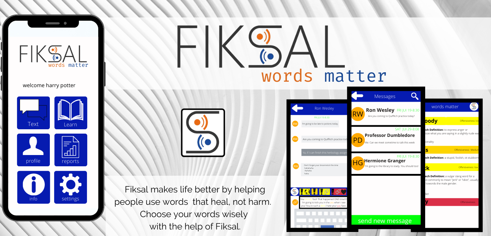
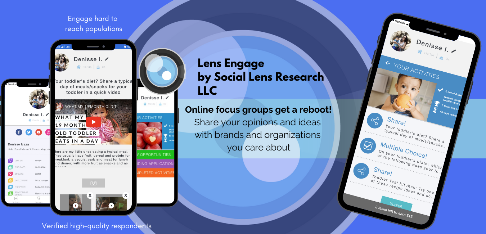
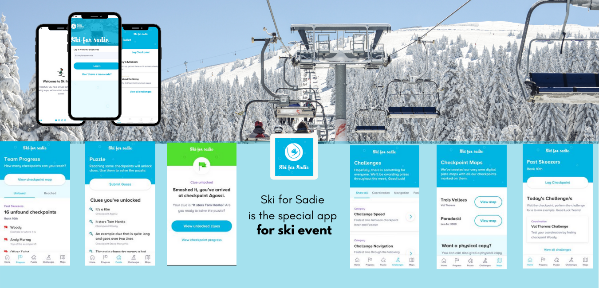
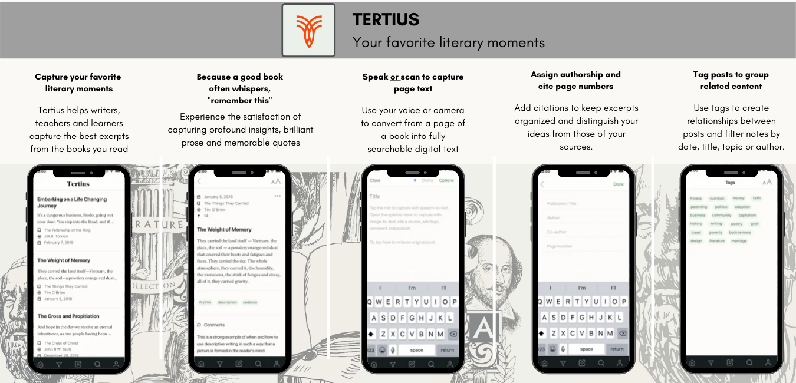

# Senior Mobile Engineer - React Native

## Bio

I'm a results-driven senior software engineer with 10 years of experience specializing in React Native Mobile Application Development. As a react native expert, I have comprehensive experience in the research and development areas and I can make anything from a small mobile app to full large-scale mobile applications.

I'm an enthusiastic & talented team player and am also a deep creative thinker for strategic problem-solving. Working on the previous projects, I learned how to organize the architecture of large-scale data-rich mobile apps with good user experiences.

I am standing at the edge of technologies and working with the most famous technologies like React, Swift, Kotlin etc. Being a kind of faster learner, I'm always hungry to learn new concepts and edge technologies and always strive to implement the best practices in the features.

## Portfolio

<!--  -->

## My backgrounds for react native mobile app development

 - React Native Project Management
 - Pixel Perfect Front End Development
 - Performance Optimization
 - Problem Solving & Critical issue fixing
 - CI/CD & Automated Testing
 - Native skills and experiences in Kotlin/Java & Swift/Objective-C

## Experienced skills

 - React Native cli & expo
 - Payment Processing in stripe, plaid, braintree, modern-treasury, etc
 - Location tracking and map in google map, mapbox, and other various services
 - Cloud Services: Firebase, AWS, Airtable, etc
 - Database: SQLITE, MySQL, PostgreSQL, etc
 - Node.js/React
 - ...
